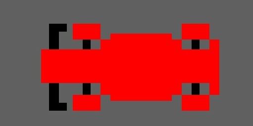
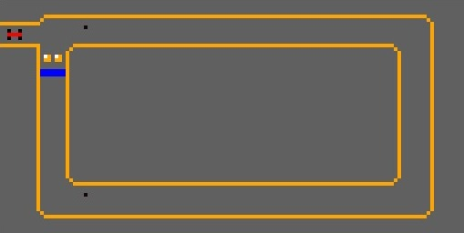

# 🏁 Racing Game Map (MIPS)

## 🖥️ Initial Screen

When the program starts, the game displays the **initial screen** on the Bitmap Display.

On this screen:

- The track is not active yet  
- The game waits for the player’s input  
- It serves as the starting point or as the return screen after a restart  

### Game Preview

    <figure>
        
        <figcaption><strong>Initial Screen</strong></figcaption>
    </figure>

    <figure>
        
        <figcaption><strong>Game Screen in Action</strong></figcaption>
    </figure>

### ▶️ Start the Game

- Press **Z** to start the race

---

## 🕹️ How to Play

### 🎯 Movement

Use the following keys to control the car:

- **W** → move up  
- **S** → move down  
- **A** → move left  
- **D** → move right  

### 🔄 Restart

- **R** → restarts the game after a collision or defeat  

### ▶️ Start

- **Z** → starts the game from the initial screen  

---

## 🏆 Win and Lose Conditions

### ✅ Victory

- Occurs when the car touches the **blue finish line**

### ❌ Defeat

- Occurs when colliding with:
  - Track borders  
  - Obstacles  

After a defeat, the game waits for the **restart command (R)**.
